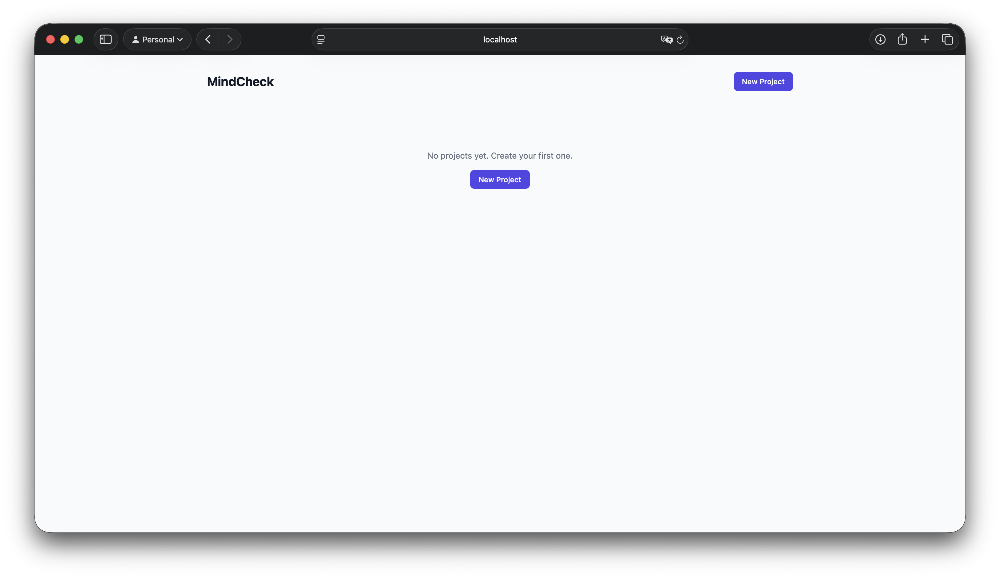
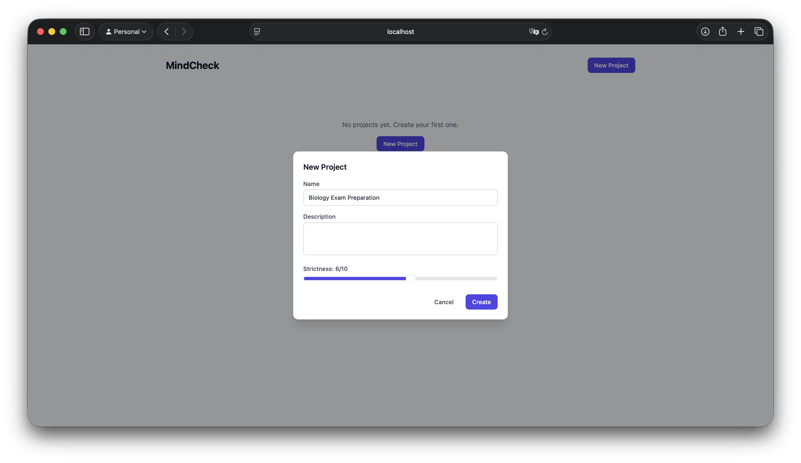
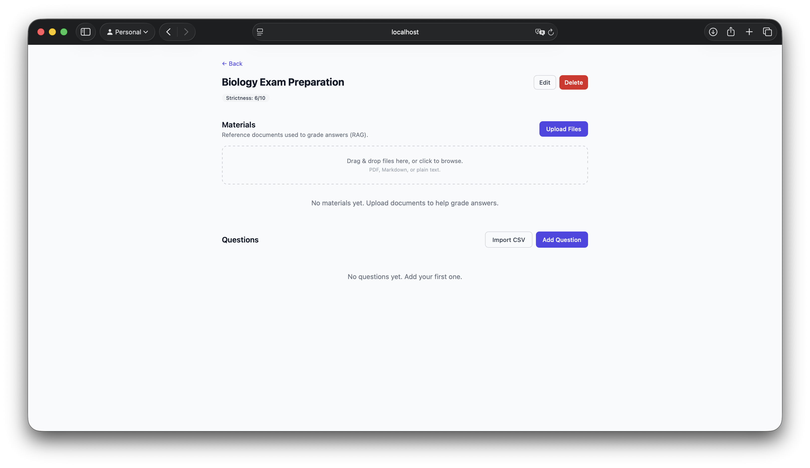
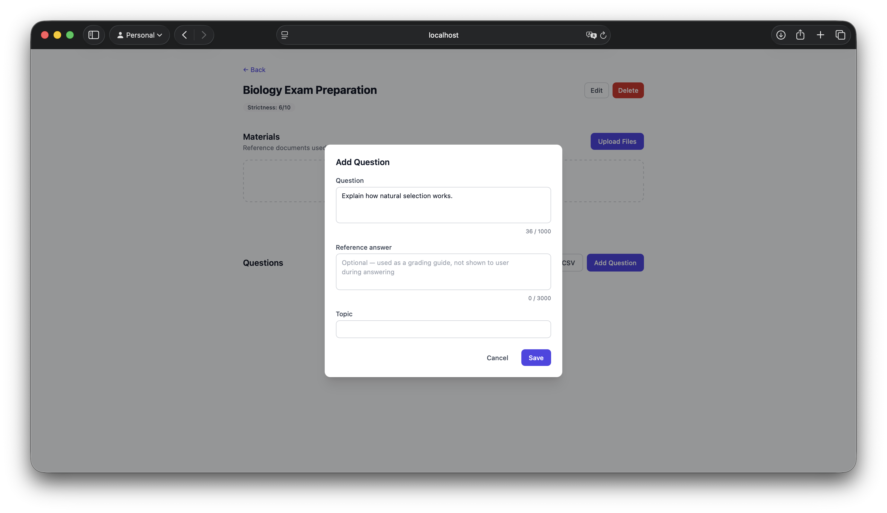
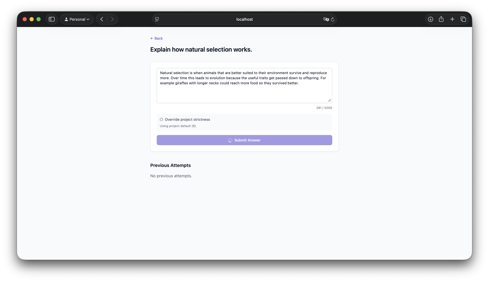
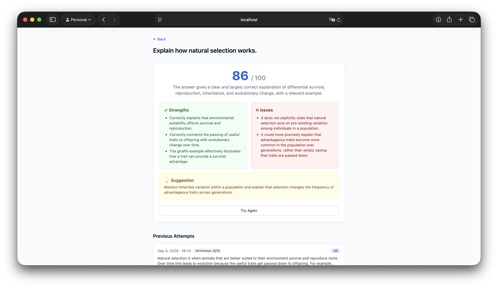

# MindCheck

An AI-powered exam and interview preparation tool. Create a project, add questions, and practice answering them — an LLM grades each answer and returns a score, strengths, issues, and a suggestion for improvement.

## Features

- Create projects with configurable grading strictness (1–10)
- Add questions manually or bulk-import from CSV, with optional reference answers
- Upload documents (PDF, Markdown, plain text) as RAG context for grading
- Submit answers and receive structured LLM feedback
- Browse attempt history per question

## Stack

- **Backend**: FastAPI, SQLAlchemy, PostgreSQL, ChromaDB
- **LLM**: OpenAI API with structured JSON output and prompt engineering for answer evaluation
- **RAG**: document upload, chunking, and vector embeddings stored in ChromaDB

## Setup
1. Clone the repository
```bash
git clone git@github.com:sariiev/mindcheck.git
```

2. Configure environment
```bash
cp backend/.env.example backend/.env
# Fill in OPENAI_API_KEY and database credentials
```

3. Start dependencies
```bash
docker compose up
```

4. Run the API
```bash
cd backend
uvicorn app.main:app --reload
```

API runs at `http://localhost:8000`

## Screenshots

### Main page


### Create project


### Created project


### Add question


### Answer question


### Evaluation


**Note:** The frontend is excluded from this repository — it was AI-generated and serves only as a demonstration interface for the backend API.